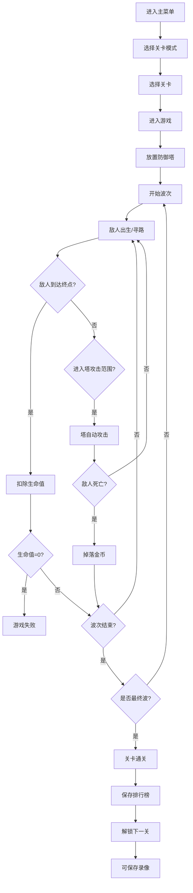

## 1. 产品概述

像素风格塔防游戏是一款基于HTML5 Canvas的浏览器单机策略游戏。玩家通过在地图上放置不同类型的防御塔，阻止一波波敌人到达终点，体验策略布局与即时战斗的乐趣。

- 核心玩法：塔防策略、技能释放、关卡挑战、自定义试炼
- 目标用户：喜欢策略游戏、像素风格游戏的休闲玩家
- 产品价值：无需安装、即开即玩、支持自定义内容分享的高品质塔防体验

---

## 2. 核心功能

### 2.1 用户角色
| 角色 | 注册方式 | 核心权限 |
|------|----------|----------|
| 普通玩家 | 无需注册，直接进入游戏 | 完整游戏体验、关卡挑战、自定义试炼、本地存档 |

### 2.2 功能模块
1. **游戏主界面**：Canvas游戏画布、塔选择栏、状态栏、技能栏、波次信息
2. **关卡模式**：10个预设关卡，难度递增，通关解锁下一关
3. **防御塔系统**：3种塔（箭塔/炮塔/魔法塔），支持3级升级，攻击范围可视化
4. **敌人系统**：多种敌人类型（普通/快速/坦克/BOSS），属性随关卡递增
5. **技能系统**：3个主动技能（冰冻减速/火箭轰击/治疗光环），Q/E/R快捷键
6. **试炼模式**：自定义波次配置（最多20波/每波50敌人），生成挑战代码分享
7. **录像系统**：战斗记录保存为JSON、导入回放观战
8. **排行榜系统**：本地IndexedDB存储前20名成绩

### 2.3 页面详情
| 页面名称 | 模块名称 | 功能描述 |
|-----------|-------------|---------------------|
| 主菜单 | 菜单面板 | 开始游戏、选择关卡、试炼模式、排行榜、录像观战入口 |
| 关卡选择 | 关卡列表 | 10个关卡图标，显示解锁状态和通关星数 |
| 游戏主界面 | 游戏画布 | Canvas 2D渲染地图、塔、敌人、弹道、特效 |
| 游戏主界面 | 顶部状态栏 | 显示金币、生命值、当前波次、关卡号、用时 |
| 游戏主界面 | 底部塔栏 | 三种塔图标，显示价格，点击选中后在地图放置 |
| 游戏主界面 | 技能栏 | 三个技能图标，显示冷却进度，Q/E/R快捷键提示 |
| 游戏主界面 | 塔升级弹窗 | 点击已放置的塔弹出升级面板，显示属性和升级费用 |
| 试炼模式 | 配置面板 | 波次数量滑块、每波敌人数量配置、敌人类型比例调节 |
| 试炼模式 | 代码分享 | 生成Base64编码的挑战代码、复制按钮、输入代码加载 |
| 录像面板 | 管理界面 | 保存当前录像为JSON文件、选择本地文件导入回放 |
| 排行榜 | 榜单列表 | 显示前20名：关卡号、剩余血量、用时、日期 |

---

## 3. 核心流程

### 3.1 标准关卡流程
用户从主菜单选择关卡模式 → 选择已解锁关卡 → 进入游戏 → 使用金币放置防御塔 → 开始波次 → 敌人沿路径前进 → 塔自动攻击范围内敌人 → 击杀敌人获得金币 → 使用技能辅助防守 → 敌人到达终点扣除生命值 → 生命值为0游戏结束 → 通关后保存成绩到排行榜 → 解锁下一关 → 可选择保存录像

### 3.2 试炼模式流程
选择试炼模式 → 配置波次参数 → 生成挑战代码 → 复制分享/直接开始 → 游戏过程同标准流程 → 完成后可保存成绩

### 3.3 录像观战流程
主菜单选择录像观战 → 导入JSON录像文件 → 进入观战模式 → 自动回放战斗过程 → 支持播放/暂停/倍速控制

---

## 4. 用户界面设计

### 4.1 设计风格
- **主色调**：复古像素风格，深蓝夜空 `#1a1a2e` 为背景主色，暖橙 `#ff9800` 为强调色，嫩绿 `#4caf50` 表示成功/血量，赤红 `#f44336` 表示危险/伤害
- **像素美术**：所有游戏元素（塔、敌人、地图格子）使用16x16或32x32像素风格绘制，Canvas设置 `imageRendering: pixelated` 保持锐利
- **字体**：主标题使用像素风字体 `Press Start 2P`（Google Fonts引入），正文使用 `Courier New` 等宽字体
- **按钮风格**：3D凸起像素按钮，悬停时轻微上浮，点击时下压凹陷效果，边框为双像素线
- **图标/emoji**：使用像素化绘制的图标替代emoji，塔图标为简化像素图形，技能图标带魔法光效

### 4.2 页面设计概述
| 页面名称 | 模块名称 | UI元素 |
|-----------|-------------|-------------|
| 主菜单 | 菜单面板 | 居中像素边框面板，标题渐入动画，按钮逐个弹出带延迟，背景星空粒子效果 |
| 游戏主界面 | 整体布局 | 顶部状态栏固定高度，中间Canvas自适应占满剩余空间，底部塔栏+技能栏横向排列 |
| 游戏主界面 | 游戏画布 | 地图网格半透明显示，塔范围圆圈半透明填充，攻击弹道像素拖尾，伤害数字飘字 |
| 游戏主界面 | 塔选择栏 | 三栏横向排列，每栏显示塔像素图标、名称、金币价格、选中状态高亮边框 |
| 游戏主界面 | 技能栏 | 三格技能按钮，带冷却覆盖遮罩（圆形进度条），右下角标注Q/E/R键位 |
| 塔升级弹窗 | 升级面板 | 点击塔位置弹出，显示当前等级、攻击力、攻速、范围数值，升级按钮+费用 |
| 排行榜 | 榜单列表 | 像素边框表格，排名1-3金色/银色/铜色背景，数据左对齐 |

### 4.3 响应式设计
- **设计优先级**：桌面端优先（1280x720及以上），自适应平板和笔记本
- **Canvas适配**：监听窗口resize事件，Canvas按比例缩放居中显示，内部坐标不变
- **最小尺寸**：支持最低1024x600分辨率，低于此尺寸显示提示信息
- **像素清晰**：所有缩放使用 `imageRendering: pixelated` + `crisp-edges` 保证像素风格不模糊

### 4.4 动效设计
- **页面加载**：主菜单背景星尘粒子飘浮，标题文字像素逐字显示动画
- **放置塔**：塔从下至上弹出生长动画，伴随粒子光效
- **攻击**：弹道像素拖尾，命中目标爆裂粒子
- **技能释放**：全屏范围闪光特效，屏幕轻微震动，技能图标圆形波纹扩散
- **敌人死亡**：像素碎片四散动画，金币数字+10飘字向上消失
