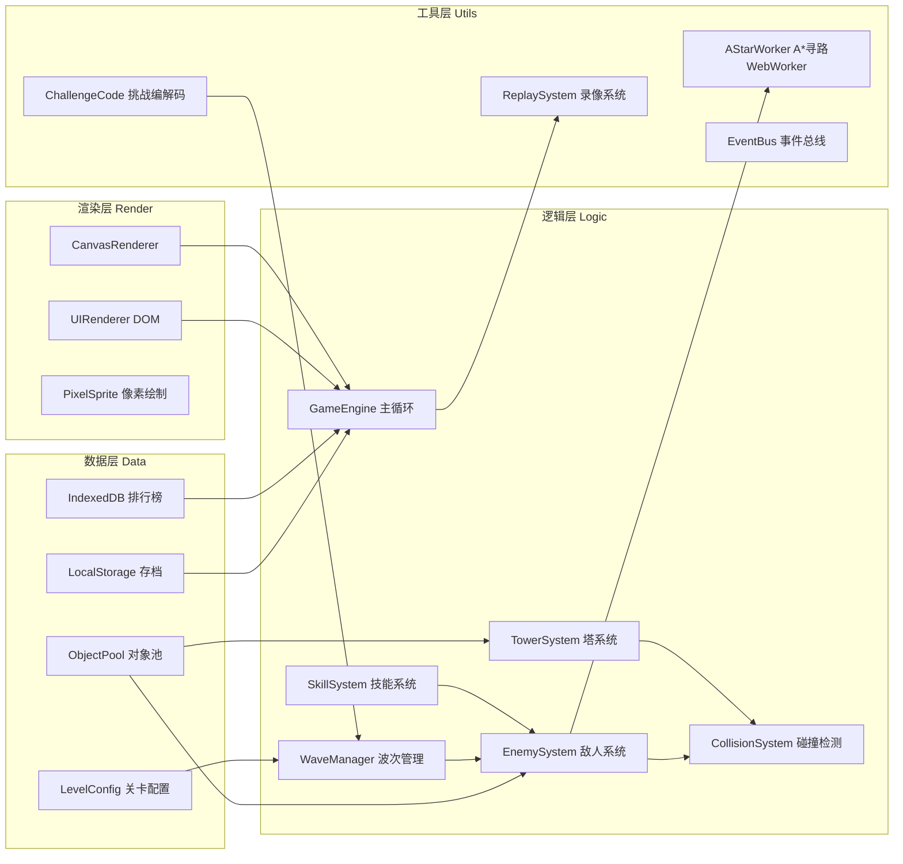

## 1. 架构设计

本项目为纯前端单机游戏，采用模块化原生JavaScript架构，无后端依赖。核心架构分为渲染层、逻辑层、数据层和工具层四层。



---

## 2. 技术描述

- **前端框架**：原生 JavaScript (ES6+)，无第三方框架依赖
- **渲染技术**：HTML5 Canvas 2D API，像素风使用 `imageRendering: pixelated`
- **CSS**：原生 CSS3 + CSS Variables，无预处理器
- **字体**：Google Fonts - Press Start 2P（像素风标题）
- **离线计算**：Web Worker 负责 A* 寻路算法，避免阻塞主线程
- **本地存储**：
  - IndexedDB：排行榜数据（大容量，结构化存储）
  - localStorage：关卡解锁进度、用户设置（KV 结构）
- **性能优化**：
  - 对象池模式：最多200个敌人对象复用，避免频繁GC
  - requestAnimationFrame 主循环，固定逻辑步长
  - 空间分区：塔攻击范围检测使用网格分区优化
- **初始化方式**：零构建，直接双击 index.html 即可运行

---

## 3. 文件结构与模块定义

```
h045/
├── index.html                    # 主入口，包含所有DOM结构
├── css/
│   └── style.css                 # 全部样式，UI面板、按钮、响应式
├── js/
│   ├── main.js                   # 入口文件，初始化游戏
│   ├── config/
│   │   ├── towerConfig.js        # 塔属性配置（3种塔×3级）
│   │   ├── enemyConfig.js        # 敌人属性配置（4种类型）
│   │   ├── skillConfig.js        # 技能配置（Q/E/R）
│   │   └── levelConfig.js        # 10关预设关卡地图+波次
│   ├── core/
│   │   ├── GameEngine.js         # 游戏主循环、状态管理
│   │   ├── ObjectPool.js         # 通用对象池（敌人类）
│   │   └── EventBus.js           # 发布订阅事件总线
│   ├── render/
│   │   ├── CanvasRenderer.js     # Canvas绘制主类
│   │   ├── SpriteFactory.js      # 像素图形生成（程序绘制）
│   │   └── ParticleSystem.js     # 粒子特效系统
│   ├── map/
│   │   ├── GameMap.js            # 地图数据结构、格子管理
│   │   ├── PathManager.js        # 路径管理、寻路请求调度
│   │   └── astar.worker.js       # Web Worker：A*算法实现
│   ├── entities/
│   │   ├── Tower.js              # 防御塔类（攻击、升级逻辑）
│   │   ├── Enemy.js              # 敌人类（移动、血量、属性）
│   │   ├── Projectile.js         # 弹道/子弹类
│   │   └── Skill.js              # 技能实例类
│   ├── systems/
│   │   ├── TowerSystem.js        # 塔管理、批量更新
│   │   ├── EnemySystem.js        # 敌人管理、出生回收
│   │   ├── SkillSystem.js        # 技能冷却、释放效果
│   │   └── WaveSystem.js         # 波次调度、敌人生成节奏
│   ├── ui/
│   │   ├── UIManager.js          # UI面板切换、DOM操作
│   │   ├── MainMenu.js           # 主菜单逻辑
│   │   ├── LevelSelect.js        # 关卡选择
│   │   ├── TrialMode.js          # 试炼模式配置+挑战代码
│   │   ├── Leaderboard.js        # 排行榜展示
│   │   └── ReplayPanel.js        # 录像导入导出面板
│   ├── data/
│   │   ├── IndexedDBManager.js   # IndexedDB封装（排行榜）
│   │   └── SaveManager.js        # localStorage存档管理
│   └── utils/
│       ├── ReplayRecorder.js     # 战斗记录/读取
│       ├── ChallengeCodec.js     # 挑战代码Base64编解码
│       ├── MathUtil.js           # 数学工具（碰撞、距离）
│       └── PerfMonitor.js        # FPS/性能监控
└── assets/
    └── (无外部资源，像素图形全部程序生成)
```

---

## 4. 核心数据结构

### 4.1 地图数据
```javascript
// 二维数组：每格32px，地图尺寸 25列 x 16行 = 800x512px
// 0=空地可通行  1=障碍不可通行  2=塔位(可放塔不可通行)  3=起点  4=终点
const mapGrid = [
  [1,1,1,1,1,1,1,1,1,1,1,1,1,1,1,1,1,1,1,1,1,1,1,1,1],
  [3,0,0,0,0,2,1,1,1,2,0,0,0,0,0,2,1,1,2,0,0,0,0,0,4],
  // ...
];
```

### 4.2 塔配置数据
| 塔类型 | 等级 | 攻击力 | 攻速(次/秒) | 范围(格) | 建造/升级费用 | 特殊效果 |
|--------|------|--------|-------------|----------|---------------|----------|
| 箭塔 Arrow | Lv1 | 15 | 2.0 | 3.5 | 50 | 单体快速攻击 |
| 箭塔 Arrow | Lv2 | 28 | 2.5 | 4.0 | +60 | 穿透1个目标 |
| 箭塔 Arrow | Lv3 | 50 | 3.0 | 4.5 | +90 | 穿透2个目标 |
| 炮塔 Cannon | Lv1 | 45 | 0.8 | 3.0 | 100 | 范围爆炸伤害 |
| 炮塔 Cannon | Lv2 | 85 | 1.0 | 3.5 | +120 | 爆炸范围+50% |
| 炮塔 Cannon | Lv3 | 160 | 1.2 | 4.0 | +180 | 燃烧持续伤害 |
| 魔法塔 Magic | Lv1 | 25 | 1.5 | 3.0 | 80 | 减速30%持续2秒 |
| 魔法塔 Magic | Lv2 | 45 | 1.8 | 3.5 | +100 | 减速50%持续3秒 |
| 魔法塔 Magic | Lv3 | 80 | 2.0 | 4.0 | +150 | 连锁闪电跳3个 |

### 4.3 敌人配置数据
| 敌人类型 | 基础血量 | 速度(格/秒) | 金币奖励 | 外观特征 |
|----------|----------|-------------|----------|----------|
| 普通 Normal | 60 | 1.5 | 10 | 绿色像素方块 |
| 快速 Fast | 40 | 2.8 | 15 | 黄色瘦小像素 |
| 坦克 Tank | 220 | 0.8 | 35 | 深蓝厚甲像素 |
| 精英 Elite | 150 | 1.8 | 30 | 紫色带装饰 |
| BOSS | 1500 | 0.6 | 300 | 大号红色，每5关出现 |

**属性成长系数**：第N关敌人属性 = 基础值 × (1 + 0.18×(N-1))

### 4.4 技能配置
| 技能 | 快捷键 | 冷却时间 | 效果描述 |
|------|--------|----------|----------|
| 冰冻减速 Freeze | Q | 30秒 | 全屏敌人减速70%，持续5秒 |
| 火箭轰击 Rocket | E | 60秒 | 鼠标位置半径150px范围造成300真实伤害 |
| 治疗光环 Heal | R | 45秒 | 恢复10点生命值，冷却期间击杀敌人额外多50%金币 |

### 4.5 挑战代码编码结构
挑战代码为 Base64 编码的 JSON 字符串，结构：
```javascript
{
  v: 1,              // 版本号
  t: "trial",        // 类型标识
  w: 15,             // 波次数 (1-20)
  waves: [           // 每波配置
    { count: 20, ratio: { normal: 0.7, fast: 0.2, tank: 0.1 } },
    // ...共w项
  ],
  seed: 12345        // 随机种子，保证同码同局
}
```

---

## 5. 关键算法与性能指标

### 5.1 A* 寻路算法（Web Worker）
- **启发函数**：曼哈顿距离（四方向移动）
- **开放列表**：二叉堆优化，取最小值 O(log n)
- **超时保护**：单次寻路 > 5ms 时自动简化路径
- **路径缓存**：同起点终点的路径复用至地图变更
- **Worker 通信**：主线程发送 `{start, end, grid}`，Worker 返回 `{path: [{x,y}...]}`

### 5.2 对象池实现
- 池大小：固定200个 Enemy 对象预创建
- 接口：`pool.acquire()` 获取空闲对象，`pool.release(obj)` 归还
- 状态标识：每个对象带 `_active` 布尔字段，更新时只遍历 active 对象
- 满池策略：池满时优先淘汰距终点最远的敌人

### 5.3 碰撞检测优化
- 塔攻击检测：空间哈希网格，每格 64px，塔注册到所在格及相邻格
- 弹道命中：圆-圆快速距离检测，`dx*dx + dy*dy < (r1+r2)^2` 避免开方

### 5.4 性能指标达成方案
| 指标 | 目标 | 实现方案 |
|------|------|----------|
| 帧率 | ≥50FPS（200敌+20塔） | Canvas批量绘制、离屏缓存塔图形、对象池减少GC |
| 寻路耗时 | ≤5ms/帧 | Web Worker离线计算+路径缓存，主线程无等待 |
| 内存稳定 | 无内存泄漏 | 对象池复用、事件监听移除、Image元素复用 |
| 首屏加载 | ≤2秒 | 无外部资源依赖，程序绘制所有像素图形 |

---

## 6. 录像系统数据格式

```javascript
// 录像JSON结构
{
  version: 1,
  levelId: 3,                    // 关卡号，0表示试炼
  challengeCode: "xxx",          // 试炼挑战码（若有）
  duration: 245.3,               // 总用时秒
  result: "win",                 // win/lose
  startHp: 20, endHp: 12,
  finalGold: 320,
  frames: [                      // 关键帧，约每0.5秒记录
    { t: 0.0, event: "wave_start", wave: 1 },
    { t: 1.234, event: "tower_place", type: "arrow", x: 5, y: 3 },
    { t: 2.100, event: "tower_upgrade", id: 7, level: 2 },
    { t: 5.400, event: "enemy_spawn", type: "normal", pathId: 0 },
    { t: 12.780, event: "skill_cast", skill: "freeze" },
    { t: 45.000, event: "wave_end", wave: 1 }
  ],
  enemies: [                     // 每个敌人完整记录
    { id: 1, type: "normal", spawnT: 5.4, deathT: 9.8, path:[{t,x,y}...] },
  ]
}
```
